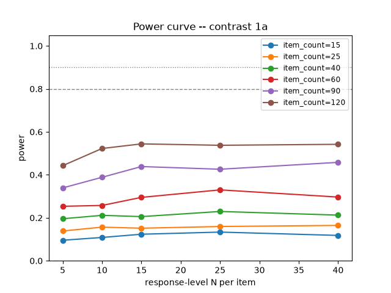
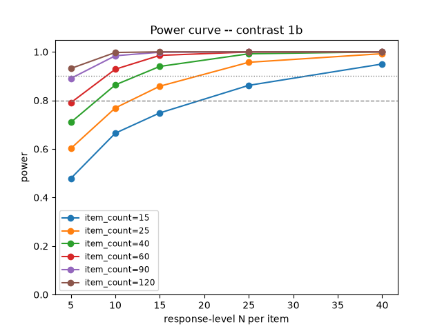
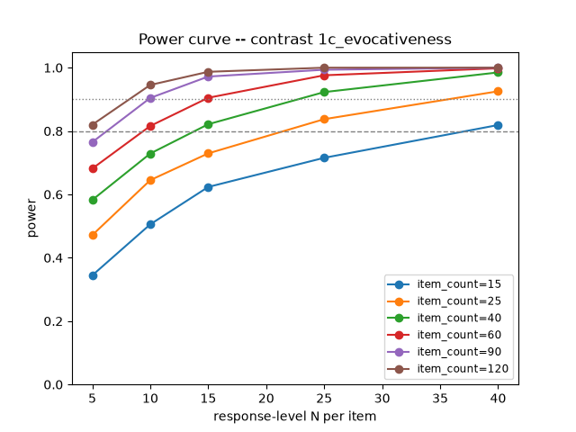
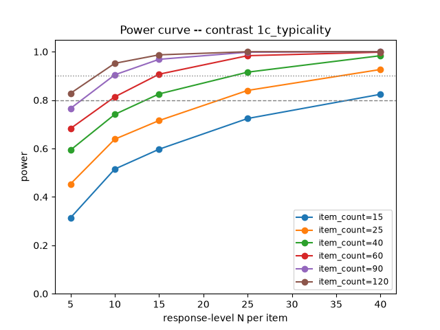
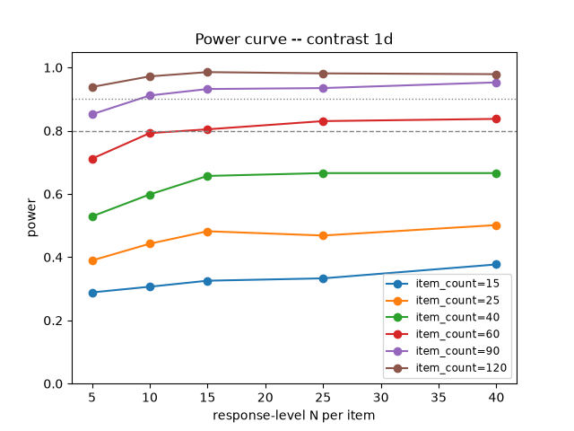

# WO-4 pilot power decision report

Gate artifact for G2 (WO4_pilot_power.md §3): states the chosen response-level N and whether the per-cell item count must grow, at 80%/90% power, per RQ1 sub-question contrast. `item_count` below is a PER-CELL item target (DR §16), and the multiplier from item_count to TOTAL families simulated differs by contrast -- see each contrast's own note below and `power_sim.FAMILY_MULTIPLIER`.

## Caveats (read before using this report to set G2 family counts)

- **No item-in-family variance component is estimated or simulated anywhere in this report.** Only two variance components are used throughout (family, response-level residual -- WO-4 §1's per-subject-model simplification, itself required by a statsmodels `MixedLM` limitation, see `power.py`'s module docstring): item-to-item variation within a family folds into the residual term instead of getting its own component. Every power number in this report may therefore be systematically OPTIMISTIC relative to the true design, which has a genuine item-level source of noise on top of family and residual variance.
- **1b (blame/praise slope difference) is NOT yet calibrated to real blame/praise scales.** Its power curve is simulated from a fictional standardized predictor (x ~ N(0, 1)) around an arbitrary base_slope of 0.5, combined with a placeholder effect-size magnitude borrowed from the other contrasts' pilot-derived MB-MG gap (see `power_sim.simulate_1b`'s docstring) -- it is not a slope estimated from real pilot blame/praise data. Do not let 1b's numbers in this report drive family-count decisions until real pilot blame/praise data exists to calibrate the predictor scale and effect size.

## Pilot variance components

| model_key | question | var_family | var_resid | ICC | n_families | n_items | n_responses | convergence_ok | fallback_used |
|---|---|---|---|---|---|---|---|---|---|
| llama-3.1-8b-instruct | intentionality | 2.9195 | 13.3083 | 0.1799 | 105 | 420 | 8749 | True | False |
| gemma-2-9b-instruct | intentionality | 5.8012 | 4.2056 | 0.5797 | 105 | 420 | 6421 | True | False |
| mistral-7b-v0.1-instruct | intentionality | 0.5867 | 3.4225 | 0.1463 | 105 | 420 | 10298 | True | False |
| llama-3.1-8b-pretrained | intentionality | 0.0653 | 15.2814 | 0.0043 | 105 | 420 | 2500 | False | True |
| gemma-2-9b-pretrained | intentionality | 0.0648 | 12.3419 | 0.0052 | 105 | 420 | 6063 | False | True |
| mistral-7b-v0.1-pretrained | intentionality | 0.0000 | 12.0844 | 0.0000 | 105 | 420 | 3432 | False | True |

Across the whole grid: 10481/300000 simulation replicates failed to converge under mixedlm (10481 used the OLS-cluster-robust fallback to still contribute a p-value -- never dropped from the power denominator, per WO-4's convergence policy). Per-cell fallback rates are broken out in each contrast's second table below.

## Contrast 1a

Effect size simulated: 0.9396
Family multiplier for this contrast: total families simulated per grid point = item_count × 4.

Power (fraction of replicates with p < alpha):

| item_count (total families = item_count × 4) \ N | 5 | 10 | 15 | 25 | 40 |
|---|---|---|---|---|---|
| 15 (60 families) | 0.096 | 0.108 | 0.123 | 0.134 | 0.118 |
| 25 (100 families) | 0.139 | 0.157 | 0.151 | 0.160 | 0.165 |
| 40 (160 families) | 0.196 | 0.211 | 0.205 | 0.230 | 0.212 |
| 60 (240 families) | 0.254 | 0.258 | 0.295 | 0.330 | 0.296 |
| 90 (360 families) | 0.339 | 0.389 | 0.439 | 0.426 | 0.458 |
| 120 (480 families) | 0.443 | 0.522 | 0.544 | 0.537 | 0.542 |

Fallback rate (share of replicates whose p-value came from the OLS-cluster-robust fallback because mixedlm didn't converge -- a higher rate here means the power number above is less reliable):

| item_count \ N | 5 | 10 | 15 | 25 | 40 |
|---|---|---|---|---|---|
| 15 | 1.7% | 13.0% | 5.6% | 0.0% | 13.1% |
| 25 | 0.1% | 6.1% | 14.4% | 0.0% | 6.9% |
| 40 | 0.0% | 2.6% | 8.6% | 0.0% | 1.2% |
| 60 | 0.0% | 0.9% | 7.3% | 0.0% | 0.0% |
| 90 | 0.0% | 0.2% | 6.3% | 0.0% | 0.0% |
| 120 | 0.0% | 0.1% | 4.3% | 0.0% | 0.9% |

- **80% power: NOT reached** within the tested grid (max observed power 0.544 at item_count<=120) -- the per-cell item count must grow beyond what was simulated here.
- **90% power: NOT reached** within the tested grid (max observed power 0.544 at item_count<=120) -- the per-cell item count must grow beyond what was simulated here.

## Contrast 1b

**1b (blame/praise slope difference) is NOT yet calibrated to real blame/praise scales.** Its power curve is simulated from a fictional standardized predictor (x ~ N(0, 1)) around an arbitrary base_slope of 0.5, combined with a placeholder effect-size magnitude borrowed from the other contrasts' pilot-derived MB-MG gap (see `power_sim.simulate_1b`'s docstring) -- it is not a slope estimated from real pilot blame/praise data. Do not let 1b's numbers in this report drive family-count decisions until real pilot blame/praise data exists to calibrate the predictor scale and effect size.

Effect size simulated: 0.9396
Family multiplier for this contrast: total families simulated per grid point = item_count × 2.

Power (fraction of replicates with p < alpha):

| item_count (total families = item_count × 2) \ N | 5 | 10 | 15 | 25 | 40 |
|---|---|---|---|---|---|
| 15 (30 families) | 0.478 | 0.665 | 0.749 | 0.862 | 0.950 |
| 25 (50 families) | 0.602 | 0.769 | 0.859 | 0.957 | 0.993 |
| 40 (80 families) | 0.710 | 0.864 | 0.940 | 0.992 | 1.000 |
| 60 (120 families) | 0.790 | 0.928 | 0.986 | 1.000 | 1.000 |
| 90 (180 families) | 0.890 | 0.984 | 0.999 | 1.000 | 1.000 |
| 120 (240 families) | 0.931 | 0.998 | 1.000 | 1.000 | 1.000 |

Fallback rate (share of replicates whose p-value came from the OLS-cluster-robust fallback because mixedlm didn't converge -- a higher rate here means the power number above is less reliable):

| item_count \ N | 5 | 10 | 15 | 25 | 40 |
|---|---|---|---|---|---|
| 15 | 5.0% | 13.6% | 5.8% | 0.0% | 9.2% |
| 25 | 1.9% | 11.2% | 10.4% | 0.0% | 5.1% |
| 40 | 0.5% | 7.2% | 9.6% | 0.0% | 2.1% |
| 60 | 0.0% | 3.0% | 6.2% | 0.0% | 0.0% |
| 90 | 0.0% | 1.4% | 4.6% | 0.0% | 0.0% |
| 120 | 0.0% | 0.7% | 3.1% | 0.0% | 1.6% |

- **80% power reached** at item_count=15 (per cell; total families = 30), N=25.
- **90% power reached** at item_count=15 (per cell; total families = 30), N=40.

## Contrast 1c_evocativeness

Effect size simulated: 0.9396
Family multiplier for this contrast: total families simulated per grid point = item_count × 2.

Power (fraction of replicates with p < alpha):

| item_count (total families = item_count × 2) \ N | 5 | 10 | 15 | 25 | 40 |
|---|---|---|---|---|---|
| 15 (30 families) | 0.344 | 0.505 | 0.624 | 0.716 | 0.819 |
| 25 (50 families) | 0.471 | 0.645 | 0.730 | 0.838 | 0.925 |
| 40 (80 families) | 0.583 | 0.729 | 0.822 | 0.923 | 0.985 |
| 60 (120 families) | 0.681 | 0.816 | 0.905 | 0.976 | 0.998 |
| 90 (180 families) | 0.765 | 0.904 | 0.972 | 0.994 | 1.000 |
| 120 (240 families) | 0.820 | 0.946 | 0.987 | 1.000 | 1.000 |

Fallback rate (share of replicates whose p-value came from the OLS-cluster-robust fallback because mixedlm didn't converge -- a higher rate here means the power number above is less reliable):

| item_count \ N | 5 | 10 | 15 | 25 | 40 |
|---|---|---|---|---|---|
| 15 | 14.1% | 0.0% | 2.5% | 9.8% | 2.5% |
| 25 | 10.8% | 0.0% | 1.1% | 3.1% | 4.5% |
| 40 | 6.6% | 0.0% | 0.7% | 2.2% | 5.0% |
| 60 | 3.5% | 0.0% | 0.3% | 2.1% | 5.9% |
| 90 | 1.5% | 0.0% | 0.0% | 2.4% | 7.4% |
| 120 | 0.7% | 0.0% | 0.0% | 1.2% | 8.8% |

- **80% power reached** at item_count=15 (per cell; total families = 30), N=40.
- **90% power reached** at item_count=25 (per cell; total families = 50), N=40.

## Contrast 1c_typicality

Effect size simulated: 0.9396
Family multiplier for this contrast: total families simulated per grid point = item_count × 2.

Power (fraction of replicates with p < alpha):

| item_count (total families = item_count × 2) \ N | 5 | 10 | 15 | 25 | 40 |
|---|---|---|---|---|---|
| 15 (30 families) | 0.314 | 0.515 | 0.597 | 0.724 | 0.824 |
| 25 (50 families) | 0.454 | 0.638 | 0.716 | 0.840 | 0.926 |
| 40 (80 families) | 0.594 | 0.741 | 0.826 | 0.915 | 0.984 |
| 60 (120 families) | 0.682 | 0.814 | 0.907 | 0.984 | 0.998 |
| 90 (180 families) | 0.765 | 0.904 | 0.969 | 0.998 | 1.000 |
| 120 (240 families) | 0.828 | 0.952 | 0.987 | 1.000 | 1.000 |

Fallback rate (share of replicates whose p-value came from the OLS-cluster-robust fallback because mixedlm didn't converge -- a higher rate here means the power number above is less reliable):

| item_count \ N | 5 | 10 | 15 | 25 | 40 |
|---|---|---|---|---|---|
| 15 | 14.4% | 0.0% | 2.2% | 9.2% | 3.6% |
| 25 | 10.3% | 0.0% | 1.2% | 2.8% | 4.7% |
| 40 | 6.9% | 0.0% | 0.4% | 2.6% | 5.7% |
| 60 | 4.2% | 0.0% | 0.3% | 2.9% | 5.9% |
| 90 | 1.5% | 0.0% | 0.1% | 2.6% | 7.3% |
| 120 | 0.9% | 0.0% | 0.0% | 2.2% | 9.5% |

- **80% power reached** at item_count=15 (per cell; total families = 30), N=40.
- **90% power reached** at item_count=25 (per cell; total families = 50), N=40.

## Contrast 1d

Effect size simulated: 0.9396
Family multiplier for this contrast: total families simulated per grid point = item_count × 1.

Power (fraction of replicates with p < alpha):

| item_count (total families = item_count × 1) \ N | 5 | 10 | 15 | 25 | 40 |
|---|---|---|---|---|---|
| 15 (15 families) | 0.288 | 0.306 | 0.326 | 0.333 | 0.377 |
| 25 (25 families) | 0.390 | 0.443 | 0.482 | 0.469 | 0.501 |
| 40 (40 families) | 0.529 | 0.599 | 0.657 | 0.666 | 0.666 |
| 60 (60 families) | 0.712 | 0.792 | 0.804 | 0.831 | 0.838 |
| 90 (90 families) | 0.852 | 0.911 | 0.932 | 0.935 | 0.953 |
| 120 (120 families) | 0.939 | 0.972 | 0.986 | 0.982 | 0.979 |

Fallback rate (share of replicates whose p-value came from the OLS-cluster-robust fallback because mixedlm didn't converge -- a higher rate here means the power number above is less reliable):

| item_count \ N | 5 | 10 | 15 | 25 | 40 |
|---|---|---|---|---|---|
| 15 | 8.6% | 17.2% | 5.7% | 0.2% | 8.8% |
| 25 | 5.7% | 13.2% | 9.5% | 0.1% | 4.3% |
| 40 | 2.0% | 10.2% | 8.3% | 0.0% | 2.4% |
| 60 | 0.8% | 8.1% | 5.7% | 0.0% | 0.0% |
| 90 | 0.1% | 5.8% | 4.2% | 0.0% | 0.0% |
| 120 | 0.1% | 3.2% | 3.8% | 0.0% | 2.5% |

- **80% power reached** at item_count=60 (per cell; total families = 60), N=15.
- **90% power reached** at item_count=90 (per cell; total families = 90), N=10.

